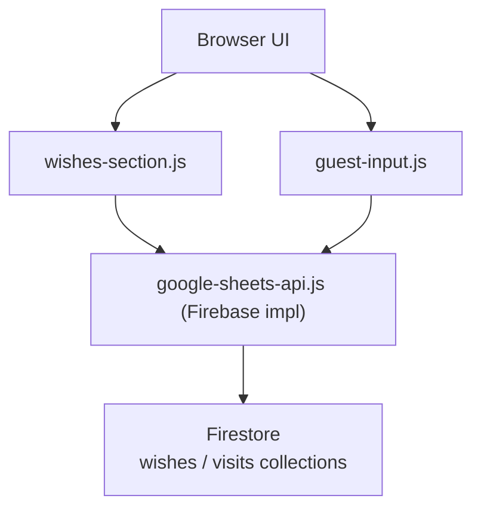

### Tổng quan mục tiêu

- **Mục đích**: Chuyển backend xử lý `wishes` (và `recordVisit` nếu muốn) sang Firebase để giảm độ trễ, ổn định hơn, và dễ mở rộng khi có thêm user.
- **Yêu cầu chính**:
  - Giữ nguyên UI/UX hiện tại (popup gửi wish, layout giấy note, timeline invitation).
  - Không đổi interface JS bên ngoài (`window.googleSheetsAPI.getWishes/addWish/recordVisit`) để tránh phải sửa nhiều file.
  - Dữ liệu được lưu trong Firestore (hoặc Realtime Database, nhưng plan này ưu tiên Firestore).

### Kiến trúc đề xuất

- **Frontend** (giữ nguyên):
  - `guest-input.js`: tiếp tục gọi `googleSheetsAPI.recordVisit`.
  - `invitation-section.js`: không cần backend mới (trừ khi sau này muốn log thêm).
  - `wishes-section.js`: tiếp tục gọi `googleSheetsAPI.getWishes` và nhận data `{ message, guestName, ... }`.
  - `invitation-section.js` / popup gửi wish: tiếp tục dùng `googleSheetsAPI.addWish`.
- **Backend Firebase (Firestore)**:
  - **Collection `wishes**`:
    - Fields: `host` (string), `guestName` (string), `message` (string), `createdAt` (Timestamp), tùy chọn `guestAgent`/`userId` nếu cần.
  - **Collection `visits**` (tuỳ chọn, nếu muốn log lượt vào):
    - Fields: `host`, `guestName`, `visitedAt`.
  - Tất cả đọc/ghi qua Firebase Web SDK được gọi trực tiếp từ frontend.

### Bước 1: Chuẩn bị Firebase project

- **Tạo project** trên Firebase Console.
- **Bật Firestore** ở mode development (sau đó chỉnh rules an toàn hơn):
  - Chọn chế độ Native Firestore, không cần Realtime Database.
- **Thêm Web app** (Add app → Web):
  - Lấy đoạn `firebaseConfig` (apiKey, authDomain, projectId, v.v.) dùng cho frontend.

### Bước 2: Thiết kế dữ liệu trong Firestore

- **Collection `wishes**`:
  - Document ID: tự sinh (`addDoc`), không cần custom.
  - Fields:
    - `host`: string (ví dụ "phatla", "hoangkaa", "kietluong").
    - `guestName`: string (tên người gửi từ overlay).
    - `message`: string (nội dung wish).
    - `createdAt`: `serverTimestamp()` để có thể sort.
- **Collection `visits**` (tuỳ chọn):
  - Fields:
    - `host`: string.
    - `guestName`: string.
    - `visitedAt`: `serverTimestamp()`.
- **Query mẫu**:
  - Lấy danh sách wishes theo host, mới nhất trước:
    - `where('host', '==', host)` + `orderBy('createdAt', 'asc' hoặc 'desc')`.

### Bước 3: Cấu hình Firestore Security Rules

- **Giai đoạn dev** (có thể cho phép rộng để test):
  - Cho phép read công khai, write có giới hạn đơn giản, ví dụ giới hạn độ dài message phía client.
- **Giai đoạn production** (tối thiểu):
  - Cho phép `read` tất cả cho public.
  - `write` chỉ cho collection `wishes` và `visits`, với validate:
    - `request.resource.data.host` phải là string, độ dài hợp lý.
    - `request.resource.data.message` không quá dài.
    - `createdAt/visitedAt` dùng `request.time` hoặc `serverTimestamp()`.

(Nếu bạn muốn, có thể bổ sung `allow write` có rate limit nhẹ bằng Cloud Functions hoặc Firestore Rules nâng cao, nhưng bước đầu có thể để đơn giản.)

### Bước 4: Tạo module Firebase client trên frontend

- Tạo file mới, ví dụ `[asset/js/firebase-client.js](asset/js/firebase-client.js)`:
  - Import SDK: dùng phiên bản modular (`firebase/app`, `firebase/firestore`).
  - Khởi tạo app với `firebaseConfig`.
  - Export các helper:
    - `getFirestoreInstance()` – trả về instance Firestore dùng chung.
    - `addWishFirestore(host, guestName, message)`.
    - `getWishesFirestore(host)`.
    - `recordVisitFirestore(host, guestName)`.
- Thiết kế hàm helpers khớp với kiểu dữ liệu mà `wishes-section.js` đang dùng:
  - Trả về array object `{ message, guestName }` giống server hiện tại.

### Bước 5: Thay implementation trong `google-sheets-api.js`

- Giữ nguyên **tên file** và **interface** để không đụng đến code khác:
  - `window.googleSheetsAPI.recordVisit(host, guestName)`
  - `window.googleSheetsAPI.getWishes(host, useCache)`
  - `window.googleSheetsAPI.addWish(host, guestName, message)`
- Bên trong, đổi implementation từ `fetchWithRetry` → gọi helper Firebase:
  - `getWishes`: gọi `getWishesFirestore(host)`, có thể thêm cache RAM/localStorage như plan frontend trước đó.
  - `addWish`: gọi `addWishFirestore(...)` và trả `{ success: true }` hoặc `{ success: false, error: ... }`.
  - `recordVisit`: gọi `recordVisitFirestore(...)`, không bắt buộc phải có response phức tạp (fire-and-forget).
- Trong giai đoạn chuyển tiếp, bạn có thể giữ lại Apps Script code (comment hoặc branch) để dễ rollback nếu cần.

### Bước 6: Giữ và cải tiến cơ chế cache phía frontend

- **Cache ngắn hạn (RAM)** vẫn dùng object `cache` trong `google-sheets-api.js` để tránh gọi Firestore liên tục khi người dùng ở lại 1 session lâu.
- **Cache dài hơn (localStorage)** để:
  - Giảm thời gian hiển thị wish khi F5.
  - Cho phép UI render ngay data cũ, fetch mới ở background.
- Logic đề xuất:
  - Khi `getWishes(host)`:
    - Thử đọc từ `localStorage` trước (`wishes_cache_<host>`), nếu còn “tươi” thì trả ngay.
    - Song song gọi Firestore để lấy data mới, nếu khác thì update cache + re-render.

### Bước 7: Tối ưu hiệu năng khi danh sách wishes dài

- Thêm giới hạn số wishes render trong `wishes-section.js`, ví dụ:
  - Lấy từ Firestore đã sort theo **thời gian**, chỉ `limit(50)` hoặc tương tự.
  - Hoặc lấy hết nhưng trên frontend chỉ render `slice(-MAX_WISHES)` (ví dụ 50–100 gần nhất).
- Lợi ích:
  - DOM nhẹ hơn, animation đỡ nặng khi có nhiều khách.
  - Tránh việc một host có hàng ngàn wish làm chậm trình duyệt, dù Firestore vẫn trả khá nhanh.

### Bước 8: Test và rollout an toàn

- **Test local** (hoặc preview) với Firebase:
  - Dùng một host test (ví dụ "devhost") để tránh lẫn với data thật.
  - Test các case:
    - Gửi wish thành công, UI toast đúng.
    - Refresh trang, wishes vẫn hiển thị.
    - Nhiều wish → UI không lag.
- **Song song với Apps Script** (nếu cần):
  - Có thể giữ một flag cấu hình (ví dụ `USE_FIREBASE_WISHES = true/false`) trong `google-sheets-config.js` để bật/tắt backend mới nhanh chóng.

### Bước 9: (Tuỳ chọn) Dashboard quản lý wishes

- Sau khi data đã nằm trong Firestore, bạn có thể làm thêm:
  - Một trang admin đơn giản (cũng dùng Firebase frontend) để xem, lọc, xoá wish theo host.
  - Hoặc dùng trực tiếp Firestore Console để xem document.
- Điều này thay thế cho việc phải vào Google Sheets để xem raw data.

